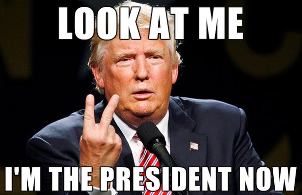
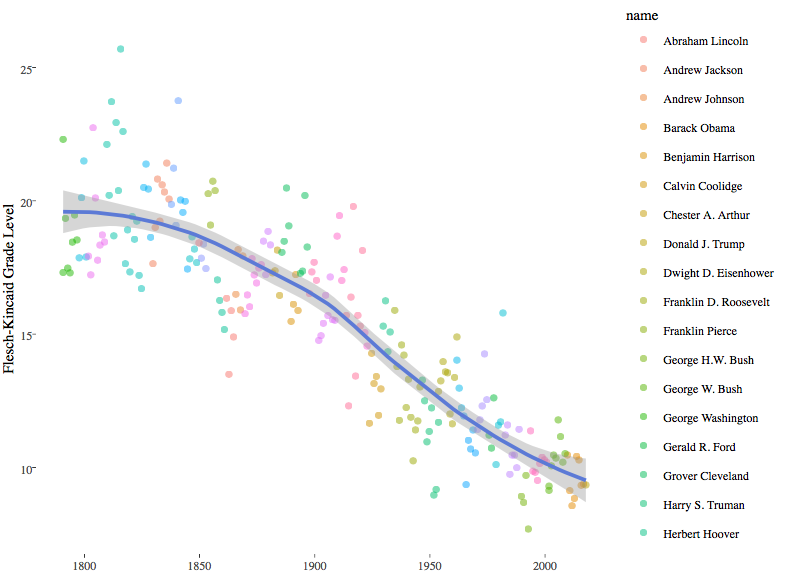
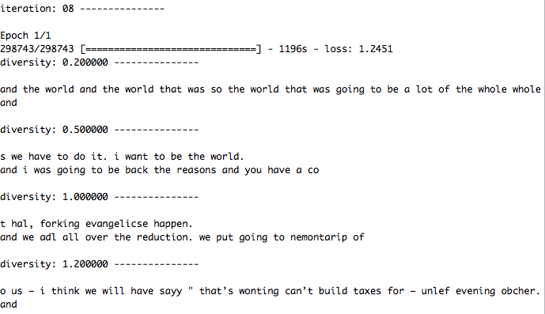

# Are speeches given by presidents become simpler? 
## plus: what may Trump say based on his previous addresses? (Fun Part)

Following Thoughts of Fall 2017 Project 1: **_What did the presidents say at their inauguation?_** 

~~No! it's not just an assignment!~~



### [Project Description](doc/)
This is the first and only *individual* (as opposed to *team*) this semester(Fall 2017). 


## Project Conductor

**Christina Huang**

## Project Summary

After analysis of speeches' sentence length in the class, I was wondering whether there is any scientific index to measure the complexity of speeches. After going through [wiki](https://en.wikipedia.org/wiki/Flesch–Kincaid_readability_tests), I found out that we can use Fresch-Kincaid Reading Ease Score to make the comparison more translatable. Thus I downloaded txt files of addresses from [this site](http://stateoftheunion.onetwothree.net/texts/index.html), since it contains more text than the dataset given in class. I used package [quanteda](https://cran.r-project.org/web/packages/quanteda/vignettes/quickstart.html) to calculate Fresch-Kincaid Reading Ease Score and visualized the result in a interactive graph.

## WHAT I FOUND

I observed a very obvious trend that complexity of recent speeches is less than that of previous speeches. In other words, speeches become simpler. Is that because of the revolution of technology to spread infomation? Or presidents are targeting to more people including those who cannot get higher education? If given more time, maybe we can connect this find with more social science features.



## Something just for FUN -- Text Generation Model for "Trump's words"

I tried to generate sentences that "sound like" given by Trump. This LSTM text generation model is based on [keras](https://keras.rstudio.com/index.html). Running this script takes TONS of time, so please **DO NOT** consider that into evaluation of "Reproducibility". After 40 epochs, it will provide some really interesting result (something like **_"i want to be the world"_**, yet sometime it gets overfitting). The training data is from [here].(https://github.com/ryanmcdermott/trump-speeches/blob/master/speeches.txt) 



## Author

Please feel free to contact me through yuchen.huang@columbia.edu

## Project Directory
Following [suggestions](http://nicercode.github.io/blog/2013-04-05-projects/) by [RICH FITZJOHN](http://nicercode.github.io/about/#Team) (@richfitz). This folder is orgarnized as follows.

```
proj/
├── lib/
├── data/
├── doc/
├── figs/
└── output/
```

Please see each subfolder for a README file.
